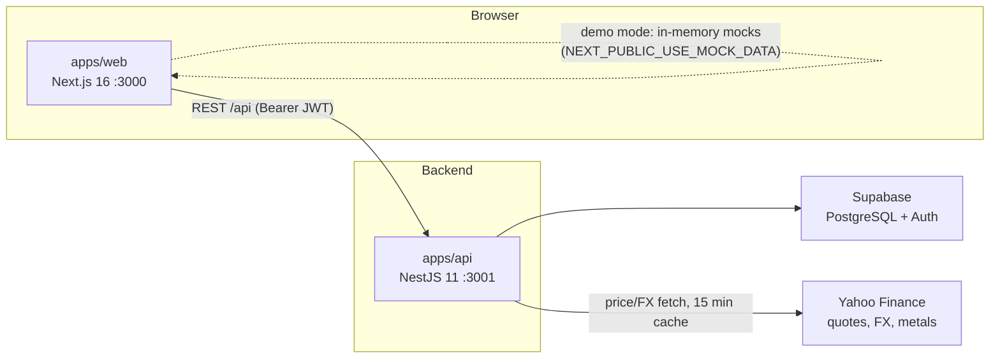

<div align="center">

# FinanceLens

### Kişisel Finans Takip Uygulaması — Full-Stack Monorepo

[](https://github.com/buraktnv/FinanceLens/actions/workflows/ci.yml)
[](https://nextjs.org/)
[](https://nestjs.com/)
[](https://www.prisma.io/)
[](https://supabase.com/)
[](https://www.typescriptlang.org/)
[](https://react.dev/)

Hisse senetleri, ETF'ler, eurobond, altın, gümüş ve nakit — tek panelden canlı fiyat verisiyle,
kâr/zarar takibi ve TRY bazında normalize edilmiş net değerle.

</div>

---

## Features

- **Stocks / ETFs / Eurobonds** — full CRUD, live Yahoo Finance prices, dividend & coupon tracking
- **Gold & Silver** — live precious-metal prices (TRY/gram) with profit/loss calculation
- **Cash accounts** — multi-currency balances normalized to TRY via live FX rates
- **Income & Expenses** — recurring income support, categorized spending with payment-method filters
- **Dashboard** — net worth, allocation donut, expense-category charts, savings rate, monthly cash flow; every non-TRY amount is FX-normalized and surfaced with staleness `warnings`
- **Status page** — runway calculation and savings projections across all assets
- **Demo mode** — run the entire UI on in-memory mock data (`NEXT_PUBLIC_USE_MOCK_DATA=true`), no backend required
- **Auth** — Supabase JWT with a global `AuthGuard` (all API routes protected by default)
- **Dark mode** — semantic design tokens with an emerald brand palette, system preference detection
- **Turkish-first UI** — tr-TR locale, ₺ currency, DD.MM.YYYY dates via a shared formatter library
- **Type-safe end to end** — Prisma types shared between web and API; all incoming API payloads validated by `class-validator` DTOs

## Architecture



| App | Port | Description |
|-----|------|-------------|
| `apps/web` | 3000 | Next.js frontend (App Router, React 19) |
| `apps/api` | 3001 | NestJS backend — Swagger at `/api/docs` |
| `apps/docs` | 3002 | Documentation site |

## Quick Start

Prerequisites: **Node.js ≥ 20.19**, **pnpm 9**.

### Option 1: Demo Mode (no backend needed)

```bash
git clone https://github.com/buraktnv/FinanceLens.git
cd FinanceLens
pnpm install
cp apps/web/.env.example apps/web/.env.local   # set NEXT_PUBLIC_USE_MOCK_DATA=true
pnpm dev --filter=web
```

Open http://localhost:3000 — the UI runs entirely on mock data.

### Option 2: Full Stack

```bash
# 1. Environment
cp apps/web/.env.example apps/web/.env.local    # Supabase keys, NEXT_PUBLIC_USE_MOCK_DATA=false
cp apps/api/.env.example apps/api/.env          # DATABASE_URL + Supabase keys

# 2. Install and generate Prisma client
pnpm install
pnpm --filter api prisma:generate
pnpm --filter api prisma db push

# 3. Run everything (web + api + docs)
pnpm dev
```

| URL | What |
|-----|------|
| http://localhost:3000 | Web app |
| http://localhost:3001/api | REST API |
| http://localhost:3001/api/docs | Swagger UI |

## API Endpoints

Global prefix `/api`. Every route requires a Bearer token (Supabase JWT) except the health check.
Resource routes below follow the same shape: `POST ''`, `GET ''`, `GET 'summary'`, `GET/PATCH/DELETE ':id'`.

| Resource | Routes |
|----------|--------|
| Stocks | `/api/stocks`, `/api/stocks/summary` |
| ETFs | `/api/etfs`, `/api/etfs/summary` |
| Eurobonds | `/api/eurobonds`, `/api/eurobonds/summary` |
| Incomes | `/api/incomes`, `/api/incomes/summary` (+ `type`, `startDate`, `endDate` filters) |
| Expenses | `/api/expenses`, `/api/expenses/summary` (+ `category`, `paymentMethod`, date filters) |
| Cash | `/api/cash`, `/api/cash/summary` |
| Gold | `/api/gold`, `/api/gold/summary` |
| Silver | `/api/silver`, `/api/silver/summary` |
| Dashboard | `GET /api/dashboard/overview` (FX-normalized, includes `fxRates` + `warnings`), `GET /api/dashboard/transactions` |
| Prices | `GET /api/precious-metals/gold/price`, `GET /api/precious-metals/silver/price`, `GET /api/yahoo-finance/search?q=`, `GET /api/yahoo-finance/quote/:symbol`, `GET /api/yahoo-finance/historical/:symbol` |
| Health | `GET /api` (public) |

Interactive documentation at `/api/docs` while the API runs locally (Swagger is disabled in production).

## Development

```bash
pnpm dev           # Run all apps
pnpm build         # Build all apps
pnpm lint          # Lint all packages
pnpm check-types   # Type-check all packages
pnpm test          # Run all tests (Jest for api, Vitest for web)
```

See [CONTRIBUTING.md](CONTRIBUTING.md) for branch conventions and the [AGENTS.md](AGENTS.md) guide for repository layout, environment variables, and codebase conventions.

<!-- SCREENSHOTS: replace the placeholders below with real captures.
Expected images (docs/screenshots/):
1. dashboard.png        — Dashboard overview (light)
2. dashboard-dark.png   — Dashboard overview (dark)
3. stocks.png           — Stocks page with price chart
4. expenses.png         — Expense category breakdown
5. status.png           — Financial status page
-->

## Roadmap

A visual product roadmap is planned at `docs/review/index.html` — coming soon.

## License

[MIT](LICENSE) © 2026 FinanceLens
